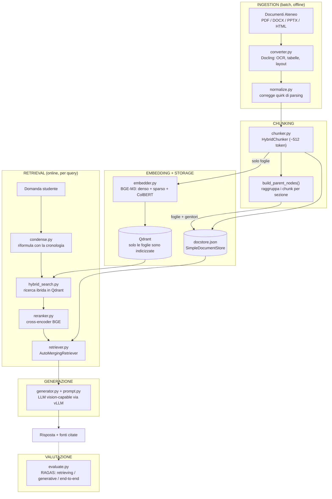

# Pipeline RAG — Guida all'Architettura Implementata

Questo documento spiega **come è costruito realmente** il sistema, componente per componente, per chi non ha mai aperto il repository. È distinto da [`Architettura di un Sistema RAG Locale per l'Assistenza Universitaria.md`](Architettura%20di%20un%20Sistema%20RAG%20Locale%20per%20l'Assistenza%20Universitaria.md), che è il documento di *progettazione* (confronto tra strumenti, scelte motivate); qui invece si descrive il codice così com'è, incluse le difficoltà incontrate durante lo sviluppo e come sono state risolte.

## 1. Obiettivo del progetto

Un assistente virtuale RAG (Retrieval-Augmented Generation) per l'assistenza universitaria, che risponde a domande su regolamenti, tasse, iscrizioni e procedure amministrative dell'Università di Bologna, basandosi **esclusivamente** sui documenti d'Ateneo indicizzati — non sulla conoscenza generale del modello linguistico. Vincoli chiave: tutto gira **in locale** (nessun servizio cloud di terze parti, per la riservatezza dei dati), su **due GPU da 16 GB**, e la **precisione numerica** (date, importi, scadenze) ha priorità sulla fluidità della risposta.

## 2. Vista d'insieme

## 3. Stack tecnologico

| Stadio | Strumento | File |
|---|---|---|
| Parsing documenti | Docling (+ SmolVLM per le immagini) | `src/ingestion/converter.py` |
| Normalizzazione | correzioni custom su quirk di Docling | `src/ingestion/normalize.py` |
| Chunking | LlamaIndex `DoclingNodeParser` + `HybridChunker` | `src/chunking/chunker.py` |
| Embedding | BAAI/BGE-M3 (denso + sparso + ColBERT) | `src/embedding/embedder.py` |
| Vector DB | Qdrant | `src/embedding/qdrant_store.py` |
| Retrieval | ricerca ibrida + reranker + `AutoMergingRetriever` (LlamaIndex) | `src/retrieval/` |
| Generazione | Qwen2.5-VL-7B-Instruct-AWQ via vLLM (OpenAI-compatible) | `src/generation/` |
| Valutazione | RAGAS | `src/eval/evaluate.py` |
| UI | Chainlit | `src/app.py` |
| Config | pydantic-settings, letto da `.env` | `src/config.py` |

Infrastruttura: `docker-compose.yml` avvia Qdrant e vLLM; BGE-M3/reranker girano in un venv locale sulla seconda GPU (§6 del documento di progettazione).

## 4. La pipeline in dettaglio

### 4.1 Ingestion — `src/ingestion/converter.py`

Legge i documenti grezzi (`datasets/raw/`) e li converte con **Docling**: OCR, riconoscimento struttura tabelle (`TableStructureOptions`), e didascalie automatiche delle immagini tramite un modello VLM leggero (`smolvlm_picture_description`) così i diagrammi diventano cercabili come testo. Output: un file `.json` (rappresentazione strutturata `DoclingDocument`, usata a valle) e un `.md` per documento, in `datasets/converted/`.

**Difficoltà incontrata e soluzione — quirk di parsing.** Docling, su documenti reali (regolamenti scannerizzati, slide con layout irregolare), a volte produce output imperfetto: intestazioni di articolo classificate come testo normale, titoli di sezione e articolo uniti in una sola riga, intestazioni/piè di pagina ripetuti che finiscono nel corpo del testo invece di essere filtrati, paragrafi spezzati su più blocchi, tabelle che attraversano un cambio pagina e vengono spezzate in due tabelle separate. `src/ingestion/normalize.py` corregge tutti questi casi con euristiche mirate (es. un testo che compare identico ≥3 volte è trattato come boilerplate ripetuto e rimosso; due tabelle adiacenti con lo stesso numero di colonne vengono ricucite in una sola). Le tabelle di tasse/scadenze sono il caso critico: se una tabella viene spezzata, solo la prima metà resta recuperabile — per questo la fusione delle tabelle paginate è esplicitamente collegata al futuro "Grounding Guard" (§7, vedi sezione Limiti).

### 4.2 Chunking — `src/chunking/chunker.py`

Ogni documento convertito viene passato a `DoclingNodeParser` + `HybridChunker` (tokenizer BGE-M3, target ~512 token, `merge_peers=True` per accorpare frammenti adiacenti troppo piccoli). Ogni chunk ("nodo foglia") porta con sé metadati: `anno_accademico`, `corso`, `categoria`, `stato` (vigente/superato — vedi Limiti), `source_file`, `source_path`, e un breadcrumb `headings` (il percorso titolo→sotto-titolo nel documento originale).

`_resolve_image_paths()` risolve un problema specifico: `DoclingNodeParser` scarta i dati binari delle immagini quando serializza i metadati del nodo, lasciando solo un riferimento (`#/pictures/3`). Per passare l'immagine **originale** al modello generativo (non solo la sua didascalia testuale, spesso troppo generica), la funzione ricarica il `DoclingDocument` originale e risolve il riferimento nel percorso file reale.

**Chunking gerarchico (nodi genitore).** `build_parent_nodes()` raggruppa i chunk foglia che condividono la stessa sezione (`source_path` + `headings` identici) sotto un nodo "genitore" sintetico, collegato ai figli tramite le relazioni native di LlamaIndex (`NodeRelationship.PARENT`/`CHILD`). Questo non altera l'indicizzazione né il retrieval per il caso comune — serve esclusivamente all'`AutoMergingRetriever` (§4.5). Sul corpus attuale: **722 chunk foglia → 101 sezioni genitore**.

### 4.3 Embedding — `src/embedding/embedder.py`

Modello **BGE-M3**, che produce in un solo passaggio tre rappresentazioni per ogni chunk: vettore **denso** (semantica), vettore **sparso** stile BM25 (termini esatti, utile per codici corso/numeri), e **ColBERT** (multi-vettore, un embedding per token, usato per un secondo stadio di similarità più preciso). Solo i chunk foglia vengono embeddati — i nodi genitore non entrano mai in questo stadio.

### 4.4 Vector Store — `src/embedding/qdrant_store.py`

Qdrant ospita una singola collezione (`ateneo_docs`) con tre "vector space" nominati (`dense`, `colbert`, `sparse`) sullo stesso punto, più un indice sul campo payload `stato` per il filtraggio. Solo le foglie vengono inserite (`upsert_nodes`); i nodi genitore restano esclusivamente nel docstore su file (`datasets/chunked/docstore.json`), non in Qdrant.

### 4.5 Retrieval — `src/retrieval/`

Tre file cooperano:

- **`hybrid_search.py`**: esegue la ricerca ibrida vera e propria in Qdrant. Prima un *prefetch* di 50 candidati sia dal vettore denso sia da quello sparso (entrambi filtrati su `stato = vigente`), poi un secondo passaggio che riordina l'unione di questi candidati usando la similarità **ColBERT** (max-sim), restituendo i 20 migliori.
- **`reranker.py`**: passa questi 20 candidati a un **cross-encoder** dedicato (`BGE-Reranker-v2-m3`), che valuta query e testo del chunk insieme (più preciso ma più lento della similarità vettoriale, per questo si applica solo al pool già ridotto) e restituisce i punteggi.
- **`retriever.py`**: orchestra tutto, e implementa il **retrieval gerarchico** (vedi §5, "difficoltà" più sotto per il perché). `HybridQdrantRetriever` incapsula la ricerca ibrida + reranking come un `BaseRetriever` di LlamaIndex, così può alimentare l'`AutoMergingRetriever` **nativo** di LlamaIndex: se abbastanza chunk fratelli (stessa sezione) compaiono tra i candidati, vengono fusi nel loro nodo genitore invece di restare frammenti isolati.

### 4.6 Generazione — `src/generation/`

- **`condense.py`**: se c'è cronologia di conversazione, un primo giro di LLM riformula l'ultima domanda dello studente in una domanda autonoma (es. "e quella dopo?" → "quando scade la seconda rata per Laurea Magistrale?"), usata poi per il retrieval. Se non c'è cronologia, si salta questo passaggio.
- **`prompt.py`**: costruisce il prompt finale — un blocco `CONTESTO` con ogni chunk preceduto da `[Fonte: <nome> - <headings>]`, le immagini associate (via `ImageBlock`, per un LLM vision-capable), e un system prompt che vincola il modello a rispondere solo da quel contesto, citando la fonte tra parentesi quadre per ogni affermazione, riportando date/importi *esattamente* come appaiono (senza arrotondare). Il footer "Fonti consultate" è generato deterministicamente dal codice (non lasciato al modello), così è sempre corretto anche se il modello dimentica di citare.
- **`generator.py`**: costruisce il client verso vLLM (`OpenAILike`, endpoint compatibile OpenAI) e orchestra la chiamata; se non ci sono chunk recuperati, restituisce un messaggio di fallback fisso invece di lasciar rispondere il modello a vuoto.

### 4.7 Configurazione — `src/config.py`

Un oggetto `Settings` (pydantic-settings) legge `.env` alla radice del repository e centralizza: URL/porte Qdrant, URL del modello generativo, device GPU per i modelli locali, soglie di retrieval, dimensione target dei chunk, numero di turni di storico conversazione. Oggi è usato in `app.py`; gli altri script (chunking, reindex) mescolano ancora percorsi hardcoded e `settings` — non tutto il codebase è stato ancora migrato.

### 4.8 Interfaccia — `src/app.py` (Chainlit)

All'avvio di una chat (`on_chat_start`) carica una volta sola: modello di embedding, reranker, client LLM, client Qdrant, docstore. Ad ogni messaggio (`on_message`): condensa la domanda, recupera i chunk, genera la risposta in streaming, mostra le fonti come elementi laterali cliccabili, e mantiene lo storico (troncato alle ultime `max_history_turns` conversazioni).

### 4.9 Reindex — `src/reindex.py`

Script standalone che ricostruisce da zero chunk (foglie + genitori) ed embedding, e re-indicizza Qdrant. Non ri-esegue il parsing Docling (costoso, non necessario se i documenti sorgente non sono cambiati) — riparte da `datasets/converted/`. Cancella e ricrea la collezione Qdrant per evitare punti orfani con ID non più presenti nel docstore.

### 4.10 Valutazione — `src/eval/evaluate.py`

Usa **RAGAS** su un set di 81 domande curate a mano (`datasets/eval/qa_test_set.json`, formato: lista piatta di `{id, question, expected_answer, verification, expected_source}`). Le metriche sono raggruppate per stadio di pipeline:

- **retrieving**: `context_precision`, `context_recall` — qualità di ciò che viene recuperato.
- **generative**: `faithfulness`, `answer_relevancy` — quanto la risposta è aderente al contesto e pertinente alla domanda.
- **end_to_end**: `answer_correctness`, `answer_similarity` — quanto la risposta finale combacia con la ground truth, dipende dall'intera pipeline insieme.

Il risultato (medie + punteggio per singolo caso) viene salvato in `datasets/eval/results.json`.

## 5. Difficoltà affrontate e soluzioni

Questa sezione documenta i problemi reali incontrati lavorando sul sistema già funzionante, non ipotetici.

### 5.1 `config.py` era silenziosamente rotto

`ROOT_DIR` era calcolato con `Path(__file__).resolve().parents[2]`, che da `src/config.py` punta **fuori dal repository** (`/home/utente` invece della cartella del progetto). Il file `.env` non veniva mai trovato, quindi ogni istanziazione di `Settings()` falliva su un campo obbligatorio mancante. **Soluzione**: `parents[1]`, e allineamento dei percorsi di default alla cartella reale `datasets/` (il default preesistente puntava a una cartella `data/` mai esistita). Contestualmente, `requirements.txt` conteneva la riga letterale `pip install chainlit` (non un requirement valido, avrebbe fatto fallire `pip install -r requirements.txt`) e mancava `pydantic-settings` pur essendo già usato: entrambi corretti.

### 5.2 Troncamento nelle chiamate di grading di RAGAS

Durante l'evaluate, ~8% delle chiamate LLM interne di RAGAS (usate per calcolare le metriche) fallivano con `IncompleteOutputException`, con fallback automatico a 1 sola generazione invece di 3 (riducendo l'affidabilità statistica delle metriche self-consistency). **Causa**: `llm_factory(...)` di RAGAS usa di default `max_tokens=1024` per il completamento — insufficiente per un output strutturato (verdetti multipli per chunk/frase). **Soluzione**: `max_tokens=4096`, dimensionato calcolando che il prompt di grading worst-case (contesto recuperato + domanda + risposta + template RAGAS) resta sotto i ~3.500 token, lasciando margine sufficiente entro la finestra di contesto di 8192 del modello servito da vLLM. Il parametro non è documentato nella signature esplicita di `llm_factory` (passa via `**kwargs`) ma è confermato nel sorgente della libreria.

### 5.3 Un caso di valutazione basato su un fatto inventato

Il caso `tasse-07` chiedeva "qual è la seconda soglia ISEE (40.000 €)... e cosa comporta rispetto alla prima?", con una faithfulness di 0.0. Analizzando il documento sorgente, **27.000 € e 40.000 € non sono due soglie graduate della stessa agevolazione** — sono condizioni indipendenti per categorie di esenzione scollegate (40.000 € compare solo abbinato ad altre condizioni specifiche: diventare genitore durante l'anno, essere vicini alla laurea, certificazioni di invalidità...). La domanda e la `expected_answer` presupponevano una gerarchia inesistente nel documento. **Lezione**: un punteggio di faithfulness basso non implica automaticamente un'allucinazione del modello — può essere il caso di valutazione stesso ad essere costruito su un fatto sbagliato.

### 5.4 Un'allucinazione reale, isolata con lo stesso metodo

Diversamente dal caso precedente, la domanda "se scelgo il pagamento a rate, quante ne devo pagare e quando?" ha prodotto una risposta con un errore fattuale genuino: "prima rata entro il 23 novembre 2026" — ma il documento dice che il 23 novembre è la data in cui **diventano visibili gli importi** della seconda/terza rata, non la scadenza della prima (che è il 24 settembre, o 19 novembre con mora). Il modello ha preso un numero reale dal contesto recuperato e l'ha attaccato al fatto sbagliato — un'allucinazione più subdola di un numero inventato di sana pianta, ed esattamente il tipo di errore per cui è pensato il futuro "Grounding Guard" (verifica letterale numero↔contesto, non solo "il numero esiste nel contesto da qualche parte").

### 5.5 Domande di sintesi che il retrieval non recuperava affatto

La domanda "quali sono le diverse metodologie di pagamento delle tasse?" restituiva sistematicamente "nessuna informazione pertinente", pur essendo l'informazione presente nel corpus. Investigando col retrieval isolato: il documento giusto **veniva trovato**, ma nessuno dei 20 candidati superava la soglia di reranking (0.3) — il migliore si fermava a 0.24. **Causa strutturale**: il chunking divide il documento per sezione/categoria di studente; nessun singolo chunk da 512 token è "dedicato" al tema generale "modalità di pagamento" — l'informazione è distribuita su più sezioni ciascuna centrata su altro (scadenze di una categoria specifica, importi, ecc.), quindi il cross-encoder non giudica mai un singolo chunk fortemente pertinente a una domanda ampia.

**Soluzione — retrieval gerarchico (`AutoMergingRetriever`).** Vedi §4.2 e §4.5: quando più chunk fratelli della stessa sezione compaiono tra i candidati, vengono fusi nel nodo genitore invece di restare frammenti isolati e scartati singolarmente. Tentativo naïve iniziale: applicare una soglia più permissiva alle sezioni fuse — ma testato su domande fattuali normali, faceva passare anche sezioni marginalmente pertinenti, diluendo il contesto proprio dove la precisione conta di più. **Soluzione finale**: soglia standard (0.3) invariata come primo tentativo per *tutte* le domande; solo se restituisce zero risultati si ritenta con una soglia permissiva (0.12) **applicata solo alle sezioni fuse**, mai ai chunk singoli. Verificato empiricamente: le domande fattuali continuano a essere risolte interamente dal passaggio standard (es. un punteggio di 0.98 per un caso reale), il fallback permissivo scatta solo quando altrimenti non ci sarebbe nessuna risposta.

### 5.6 Regressione sul filtro `stato`

Durante lo sviluppo, il campo `"stato": "vigente"` era stato rimosso da `metadata.py` (era comunque hardcoded, mai realmente popolato da una logica di validità temporale). Il filtro Qdrant su `stato = vigente` in `hybrid_search.py`, però, dipende da quel campo: senza, un nuovo re-indexing avrebbe fatto sì che **nessun punto** corrispondesse più al filtro, azzerando il retrieval. Ripristinato come parte del lavoro sul retrieval gerarchico, che richiedeva comunque un re-indexing completo.

## 6. Limiti noti e lavoro futuro

- **Grounding Guard non implementato** (§7 del documento di progettazione): non esiste ancora uno stadio che estragga automaticamente date/importi dalla risposta generata e li verifichi letteralmente contro i chunk recuperati prima di mostrarla allo studente. È il gap più rilevante rispetto al rischio dichiarato del progetto (una data sbagliata è peggio di "non lo so") — il caso §5.4 sopra è un esempio concreto di cosa intercetterebbe.
- **`stato` è sempre `"vigente"`**: il meccanismo di filtraggio esiste ed è testato, ma non c'è ancora una logica che marchi un documento come `superato`/`bozza` quando ne arriva una versione più recente.
- **Sintesi cross-documento non coperta**: l'`AutoMergingRetriever` unisce chunk della *stessa* sezione/documento. Una domanda che richiede di aggregare informazioni sparse su documenti diversi (es. "riassumi tutto il percorso dall'iscrizione alla laurea") non è ancora gestita — servirebbe query decomposition/sub-question querying.
- **`README.md` è vuoto**: nessuna istruzione di setup, pur avendo già `.env.example` e `docker-compose.yml` pronti.
- **Nessun VLM dedicato Granite-Docling**: la descrizione automatica delle immagini usa `smolvlm_picture_description` (SmolVLM), non Granite-Docling come indicato nel documento di progettazione — scelta equivalente ma non identica a quanto originariamente pianificato.

## 7. Come eseguire il progetto (riferimento rapido)

1. `cp .env.example .env` e adattare i valori (porte, device GPU).
2. `docker compose up -d` — avvia Qdrant e vLLM.
3. Popolare `datasets/raw/` con i documenti, poi `python -m ingestion.converter` (parsing) e `python -m reindex` (chunking + embedding + indicizzazione — vedi §4.9).
4. `chainlit run src/app.py` — avvia l'interfaccia conversazionale.
5. Per la valutazione: `python -m eval.evaluate` (richiede un piccolo script che carichi modelli/dataset e chiami `evaluate()`, vedi `src/eval/evaluate.py`).
