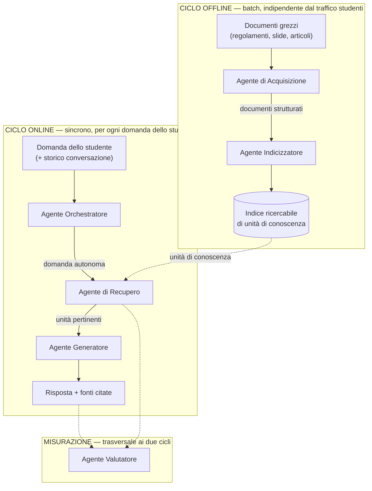
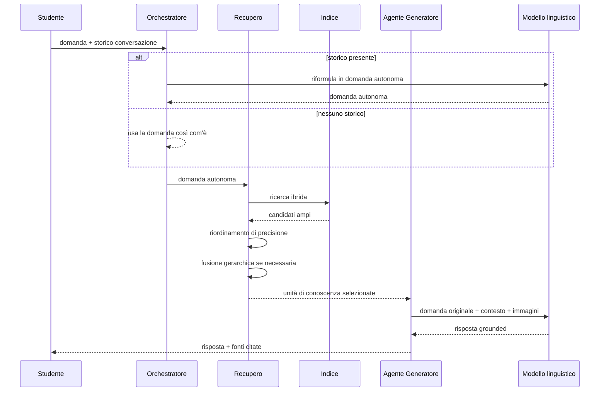

# Report Tecnico — Assistente RAG per l'Assistenza Universitaria

Questo report descrive il sistema procedendo dal generale al particolare: prima il problema che il progetto risolve, poi l'architettura, poi i componenti concreti scelti e perché, infine il design di dettaglio L'ultimo capitolo raccoglie le difficoltà reali incontrate durante lo sviluppo e come sono state risolte.

---

## 1. Analisi del problema

### 1.1 Il bisogno

Uno studente universitario deve orientarsi in un volume enorme di informazione eterogenea e dispersa: regolamenti amministrativi (tasse, scadenze, requisiti di ammissione), materiali didattici (slide, dispense, articoli scientifici), procedure operative (come iscriversi, come cambiare corso, come richiedere un'esenzione). Questa informazione cambia nel tempo, è distribuita su decine di documenti diversi, e le domande reali sono spesso puntuali ("quando scade la prima rata?") o composite ("quali sono le diverse modalità di pagamento?"). Un assistente conversazionale che risponda direttamente a queste domande, invece di costringere lo studente a cercare a mano nei PDF, è il bisogno che il progetto affronta.

### 1.2 Vincoli che definiscono il problema

Tre vincoli, emersi durante l'analisi, escludono a priori intere classi di soluzione:

1. **Riservatezza**. I documenti d'ateneo includono dati sensibili (bozze di regolamento, materiale coperto da proprietà intellettuale). L'intera infrastruttura deve girare **in locale**: nessuna chiamata a un servizio LLM cloud di terze parti.
2. **Hardware limitato**. Due GPU da 16 GB ciascuna, non necessariamente aggregabili senza overhead. Questo esclude i modelli linguistici di grandi dimensioni e impone di dimensionare ogni componente della pipeline (parsing, embedding, generazione) per convivere sullo stesso budget.
3. **Precisione fattuale come priorità assoluta**. Il sistema deve rispondere a domande su scadenze e importi. Una risposta fluida ma con una data sbagliata è **peggio** di "non lo so": è un rischio concreto per lo studente (una tassa pagata in ritardo per una data inventata dal modello). Questo vincolo condiziona ogni scelta a valle — non solo quali strumenti usare, ma come vengono usati (es. le tabelle di tasse non vengono mai riassunte, restano letterali fino al prompt finale).

Un quarto fattore, non un vincolo ma una caratteristica del dominio, complica ulteriormente il problema: l'**eterogeneità documentale**. Regolamenti con gerarchia normativa rigida e tabelle dense, slide con layout bidimensionale e contenuto prevalentemente visivo (diagrammi, schemi), articoli scientifici con formule e riferimenti bibliografici — un'unica pipeline di elaborazione deve gestire tutti e tre senza perdere struttura o contenuto.

### 1.3 Perché non basta un LLM generico

Un modello linguistico interrogato direttamente ha tre limiti strutturali per questo problema: non conosce i documenti specifici dell'ateneo (non erano nel suo addestramento), non riflette gli aggiornamenti recenti (scadenze e importi cambiano ogni anno accademico), e — soprattutto in assenza di un contesto verificabile — tende a **produrre risposte plausibili ma non verificate** quando non sa qualcosa, invece di dichiarare l'incertezza. Su un dominio dove l'errore numerico ha conseguenze reali, questo è inaccettabile.

### 1.4 Perché Retrieval-Augmented Generation

La soluzione architetturale è separare **cosa il sistema sa** (i documenti reali, aggiornabili indipendentemente) da **come il sistema si esprime** (il modello linguistico, che formula la risposta). Ad ogni domanda, il sistema recupera prima i frammenti di documento più pertinenti, poi chiede al modello di rispondere **usando solo quel contesto**, citando la fonte. Questo non elimina il rischio di errore (il modello può comunque interpretare male un numero presente nel contesto), ma lo rende verificabile: ogni affermazione è tracciabile a un documento specifico, e il sistema può essere valutato misurando quanto le risposte sono effettivamente fondate sul contesto recuperato.

---

## 2. Architettura ad alto livello

Questo capitolo descrive il sistema come una **rete di componenti cooperanti**, ciascuno con una responsabilità unica, indipendentemente dagli strumenti specifici usati per implementarli (quelli sono discussi al capitolo 3). Ogni agente riceve un input, produce un output con un contratto ben definito, e non ha bisogno di sapere come lavorano gli altri internamente.

### 2.1 I sei componenti

| Componente | Responsabilità | Riceve | Produce |
|---|---|---|---|
| **Acquisizione** | Trasforma documenti eterogenei (PDF, slide, pagine web) in una rappresentazione testuale strutturata e uniforme | Documenti grezzi | Documenti strutturati (testo, tabelle, immagini descritte) |
| **Indicizzatore** | Organizza la conoscenza in unità recuperabili e le rende ricercabili per significato | Documenti strutturati | Indice ricercabile di unità di conoscenza |
| **Orchestratore** | Gestisce lo stato della conversazione, riformula le domande implicite in domande autonome | Domanda + storico conversazione | Domanda autonoma, pronta per la ricerca |
| **Recupero** | Dato un bisogno informativo, seleziona le unità di conoscenza più pertinenti | Domanda autonoma + indice | Insieme di unità di conoscenza pertinenti |
| **Generatore** | Sintetizza una risposta in linguaggio naturale, vincolata al contenuto recuperato | Domanda + unità recuperate | Risposta con citazione delle fonti |
| **Valutatore** | Misura la qualità del sistema lungo l'intera catena | Domande di test + risposte prodotte | Metriche di qualità per stadio |

### 2.2 Diagramma agent-based

Il sistema ha due cicli di vita distinti: uno **offline** (batch, asincrono rispetto alle domande degli studenti), che prepara la conoscenza; uno **online** (sincrono, per ogni domanda), che la usa.

### 2.3 Il contratto tra componenti, non l'implementazione

Il punto centrale di questa vista astratta: ogni componente potrebbe essere sostituito con un'implementazione diversa senza che gli altri se ne accorgano, **purché il contratto di input/output resti lo stesso**. Il componente di Recupero, ad esempio, non sa e non deve sapere come l'Indicizzatore ha organizzato l'indice internamente — sa solo che, data una domanda, può interrogarlo e ottenere unità di conoscenza pertinenti.

### 2.4 Perché due cicli separati

Separare il ciclo offline da quello online non è solo un dettaglio implementativo: è una scelta che discende direttamente dal vincolo hardware. Il componente di Acquisizione, quando deve descrivere il contenuto visivo di centinaia di immagini, può permettersi di essere lento — non c'è uno studente in attesa. L'Agente Generatore, al contrario, deve rispondere in tempo ragionevole a più studenti contemporaneamente. Tenerli separati permette di dimensionare (e schedulare) le risorse GPU in modo diverso per i due cicli, invece di sovradimensionare tutto per il caso peggiore.

---

## 3. Componenti e scelte architetturali

Qui si passa dall'astratto al concreto: quali strumenti implementano ciascun agente, e perché sono stati scelti loro invece di alternative plausibili.

### 3.1 Panoramica

| Componente | Strumento concreto | Motivazione sintetica |
|---|---|---|
| Acquisizione | **Docling** (parsing) + un modello di visione per le immagini | Unico strumento tra le alternative valutate con supporto nativo multi-formato (PDF/DOCX/PPTX/HTML) *e* comprensione visiva integrata — necessario per non dover mantenere pipeline separate per regolamenti e slide |
| Indicizzazione | **LlamaIndex** (chunking strutturato) + **BGE-M3** (embedding) + **Qdrant** (vector store) | LlamaIndex si integra nativamente col modello dati del parser, preservando la gerarchia titolo→sezione dei regolamenti; BGE-M3 produce in un solo modello tre rappresentazioni complementari (dense, sparse, multi-vettore) coprendo sia query semantiche sia query su termini esatti (codici corso, numeri); Qdrant supporta nativamente la ricerca ibrida e il filtraggio sui metadati con overhead di RAM contenuto |
| Orchestrazione conversazionale | Un LLM leggero dedicato alla riformulazione | Serve solo a rendere autonoma una domanda di follow-up — non serve un modello pesante per questo, e si può saltare del tutto quando non c'è storico |
| Recupero | Ricerca ibrida + un modello di reranking dedicato + fusione gerarchica | La ricerca vettoriale da sola non è abbastanza precisa; un cross-encoder che valuta query e testo insieme migliora sensibilmente la selezione finale; la fusione gerarchica risolve i casi dove nessun singolo frammento è mai giudicato pertinente da solo |
| Generazione | Un modello linguistico **vision-capable**, quantizzato, servito con un motore ottimizzato per il throughput multi-utente | Deve poter ragionare anche sulle immagini associate ai frammenti recuperati (non solo sulla loro didascalia testuale), e deve reggere più studenti in contemporanea entro il budget di una singola GPU |
| Valutazione | Un framework di metriche automatiche per RAG, applicate separatamente a recupero/generazione/risultato finale | Misurare i tre stadi separatamente è ciò che permette di capire *dove* la pipeline perde qualità, non solo *se* la perde |

### 3.2 Il vincolo hardware come forza trainante delle scelte

Ogni scelta di modello in questo progetto è passata da un unico filtro: deve convivere con le altre sullo stesso budget di due GPU da 16 GB. Questo ha escluso a priori i modelli linguistici generativi di grandi dimensioni (27B+) considerati in una prima bozza, ha guidato la scelta di un modello di embedding leggero ma capace (BGE-M3, ~570M parametri) invece di alternative più pesanti, e ha portato a dedicare un'intera GPU al modello generativo (priorità a latenza e concorrenza) tenendo la seconda per i modelli "leggeri" (embedding, reranking, comprensione visiva in fase di acquisizione) che possono condividere risorse perché non competono mai per la stessa richiesta nello stesso istante.

### 3.3 Una scelta rivista in corsa: il modello di comprensione visiva

La scelta iniziale per la didascalia automatica delle immagini durante l'Acquisizione era un modello di visione molto leggero, scelto per non gravare sulla GPU dedicata all'indicizzazione. Si è rivelata insufficiente per la complessità reale dei diagrammi accademici nel corpus — un caso concreto di come un vincolo di budget, applicato senza verificare la qualità del risultato, possa silenziosamente degradare la conoscenza indicizzata. La soluzione adottata non ha richiesto di caricare un modello aggiuntivo: ha riusato, per la sola fase di acquisizione (batch, non in concorrenza con gli studenti), lo stesso modello generativo già destinato a rispondere agli studenti.

---

## 4. Design di dettaglio

Questo capitolo scende al livello del codice: come ogni agente è implementato, con cosa comunica, e dove intervenire per modificarlo.

### 4.1 Componente Acquisizione

**File**: `src/ingestion/converter.py`, `src/ingestion/normalize.py`, `src/ingestion/picture_descriptions.py`

Riceve i documenti grezzi (`datasets/raw/`) e produce, per ciascuno, una coppia di file: una rappresentazione JSON strutturata (usata dagli stadi successivi) e un Markdown leggibile. Tre passaggi in sequenza:

1. **Parsing** (`converter.py`): riconoscimento layout, OCR dove serve, riconoscimento struttura delle tabelle, estrazione ed elaborazione delle immagini.
2. **Normalizzazione** (`normalize.py`): corregge sistematicamente una serie di difetti di parsing specifici osservati sui documenti reali — dettagliato al §5.1, perché è nato interamente da problemi incontrati in corso d'opera, non da un requisito previsto in anticipo.
3. **Didascalia delle immagini** (`picture_descriptions.py`): ogni immagine viene passata a un modello di visione, che produce una descrizione testuale trattata poi come un frammento di conoscenza a sé stante — dettagliato al §5.2.

**Contratto in uscita**: un documento strutturato dove testo, tabelle (letterali, mai riassunte — vincolo §1.2) e immagini (con relativa didascalia) sono tutti rappresentati in modo uniforme, pronti per l'Agente Indicizzatore.

### 4.2 Componente Indicizzatore

**File**: `src/chunking/chunker.py`, `src/chunking/metadata.py`, `src/embedding/embedder.py`, `src/embedding/qdrant_store.py`

Tre responsabilità in sequenza:

1. **Segmentazione** (`chunker.py`): ogni documento strutturato viene diviso in frammenti (~512 token) che rispettano i confini semantici del documento (non tagliano una frase o una riga di tabella a metà), ciascuno arricchito con metadati (corso, anno accademico, percorso titolo→sezione).
2. **Struttura gerarchica** (`chunker.py`): i frammenti che appartengono alla stessa sezione del documento vengono anche collegati a un'unità "genitore" che li contiene tutti — non indicizzata di per sé, ma disponibile per essere recuperata come blocco quando serve più contesto di quanto un singolo frammento offra (il perché è al §5.7).
3. **Vettorializzazione e archiviazione** (`embedder.py`, `qdrant_store.py`): ogni frammento (solo quelli di base, non le unità "genitore") viene trasformato in tre rappresentazioni vettoriali complementari e inserito nell'indice, insieme ai suoi metadati.

**Contratto in uscita**: un indice ricercabile per similarità semantica, filtrabile sui metadati, dove ogni unità recuperabile porta con sé il testo originale, la sua posizione nella gerarchia del documento, e — se pertinente — i riferimenti alle immagini associate.

### 4.3 Componente di Recupero

**File**: `src/retrieval/hybrid_search.py`, `src/retrieval/reranker.py`, `src/retrieval/retriever.py`

Tre stadi in cascata, ciascuno più costoso ma più preciso del precedente — un imbuto che restringe progressivamente i candidati:

1. **Ricerca ibrida** (`hybrid_search.py`): una prima selezione ampia (decine di candidati) combinando ricerca su significato e ricerca su termini esatti, poi riordinata con una terza rappresentazione più fine.
2. **Riordinamento di precisione** (`reranker.py`): un modello dedicato valuta ogni candidato **insieme** alla domanda (più accurato della sola similarità vettoriale, ma troppo lento per essere applicato a tutto l'indice — per questo si applica solo al pool già ristretto dallo stadio precedente).
3. **Fusione gerarchica e selezione finale** (`retriever.py`): se più frammenti fratelli (stessa sezione, §4.2) compaiono tra i candidati con punteggio sufficiente, vengono fusi nella loro unità "genitore" invece di restare frammenti isolati; infine si applica una soglia di accettazione, con un meccanismo di ripiego più permissivo — usato solo per le sezioni fuse, e solo quando altrimenti non ci sarebbe alcun risultato — per non sacrificare la precisione sulle domande fattuali (dettagli e perché al §5.7).

**Contratto in uscita**: un piccolo insieme (tipicamente 1-6) di unità di conoscenza, ciascuna con testo, provenienza documentale, ed eventuali immagini associate, ordinate per pertinenza.

### 4.4 Componente Orchestratore

**File**: `src/generation/condense.py`, `src/app.py` (gestione dello stato di sessione)

Riceve la domanda corrente e lo storico della conversazione. Se lo storico è vuoto, non fa nulla — la domanda è già autonoma. Se c'è storico, chiede a un modello linguistico di riformulare la domanda in una versione comprensibile senza il contesto della conversazione (es. "e quella dopo?" → "quando scade la seconda rata per la laurea magistrale?"). Mantiene inoltre lo stato della conversazione (le ultime N coppie domanda/risposta) all'interno di una sessione utente.

**Contratto in uscita**: una domanda autonoma, pronta per essere usata come query di ricerca dall'Agente di Recupero.

### 4.5 COmponente Generatore

**File**: `src/generation/generator.py`, `src/generation/prompt.py`

Riceve la domanda originale (non quella condensata — quella serve solo per la ricerca) e le unità di conoscenza recuperate. Costruisce un prompt che: include il testo di ogni unità recuperata etichettato con la sua fonte; include le immagini associate (non solo le loro didascalie — il modello generativo, essendo vision-capable, può ragionare direttamente sull'immagine originale); vincola esplicitamente il modello a rispondere solo da quel contenuto, riportando numeri e date esattamente come appaiono; istruisce il modello a citare la fonte per ogni affermazione. Se non è stata recuperata nessuna unità di conoscenza, non interpella nemmeno il modello — restituisce direttamente un messaggio di assenza di informazione, per non rischiare che il modello risponda comunque a vuoto.

**Contratto in uscita**: una risposta in linguaggio naturale, con citazione delle fonti realmente usate.

### 4.6 Componente Valutatore

**File**: `src/eval/evaluate.py`, dataset di domande curate manualmente

Esegue un insieme di domande di test attraverso l'intera pipeline (Orchestratore → Recupero → Generatore) e misura, separatamente:

- **Qualità del recupero**: le unità di conoscenza recuperate contengono davvero l'informazione rilevante, ed è ben posizionata (non sepolta in fondo)?
- **Qualità della generazione**: la risposta è davvero fondata sul contenuto recuperato, ed è pertinente alla domanda?
- **Qualità end-to-end**: la risposta finale, nel suo complesso, combacia con quanto atteso — una misura che dipende dall'intera catena insieme, non da un singolo stadio.

Questa separazione per stadio è ciò che permette di diagnosticare *dove* intervenire quando qualcosa non va (un caso reale di diagnosi con questo metodo è al §5.7).

### 4.7 Configurazione trasversale

**File**: `src/config.py`

Un livello di configurazione condiviso, letto da un file di ambiente non versionato, che centralizza gli indirizzi dei servizi, le credenziali GPU, e le soglie numeriche usate dagli agenti (di recupero, in particolare). Non tutti gli agenti lo consumano ancora in modo uniforme — è un lavoro di consolidamento tuttora in corso.

### 4.8 Il flusso completo di una domanda

---

## 5. Difficoltà riscontrate e soluzioni

Questo capitolo non descrive il sistema come funziona idealmente, ma **come ci si è arrivati** — i problemi reali incontrati e perché le soluzioni adottate sono quelle che sono.

### 5.1 La normalizzazione: perché è stata necessaria

Il parser di acquisizione, per quanto capace, non produce output perfetto su documenti reali (regolamenti scannerizzati, slide con layout irregolare). Nella pratica si sono osservati sistematicamente: intestazioni di articolo classificate come testo normale invece che come titoli di sezione; titoli di sezione e di articolo uniti in una sola riga quando avrebbero dovuto restare separati; lo stesso identico blocco di testo (intestazioni o piè di pagina ripetuti su ogni pagina, es. un'intestazione istituzionale) che finisce nel corpo del documento invece di essere scartato come elemento decorativo ripetuto; paragrafi spezzati su più blocchi di testo distinti quando erano in origine un unico paragrafo; tabelle che, attraversando un cambio pagina, vengono lette come due tabelle separate invece di una sola continua.

Nessuno di questi è un caso raro: sono difetti sistematici del parsing su questa tipologia di documenti. La soluzione non è stata cercare un parser "perfetto" (non esiste, per questa classe di problemi), ma costruire un passaggio di correzione dedicato che riconosce e ripara questi pattern specifici dopo il parsing. Il caso delle tabelle spezzate è il più critico rispetto al vincolo di precisione fattuale (§1.2): una tabella di tasse spezzata a metà lascerebbe solo la prima parte effettivamente recuperabile, con il rischio concreto di citare un importo incompleto o mancante.

### 5.2 Il problema delle immagini

Il modello di visione scelto inizialmente per descrivere automaticamente le immagini (leggero, per non gravare sulla GPU dedicata all'indicizzazione, §3.3) si è rivelato **rotto**, non solo impreciso, sui diagrammi accademici del corpus: su schemi con più elementi connessi da frecce (diagrammi di teoria dell'attività, framework concettuali), il modello entrava in un loop di ripetizione, producendo la stessa frase ("c'è una persona seduta su una sedia") decine di volte fino a esaurire il budget di generazione — senza descrivere nulla del contenuto reale del diagramma. Peggio ancora: si è verificato che questo testo rotto **finisce davvero nel contenuto indicizzato e recuperabile**, non resta isolato in un campo inutilizzato — degradando attivamente la qualità del recupero per qualunque domanda che tocchi quei contenuti visivi.

La soluzione non ha richiesto di caricare un modello di visione più grande in aggiunta a quelli già in uso: ha riusato, per la sola fase di acquisizione (offline, non in concorrenza con gli studenti — §2.4), lo stesso modello linguistico già destinato alla generazione delle risposte, che è già vision-capable per costruzione. Sono stati inoltre necessari due aggiustamenti ai parametri di generazione della didascalia: un budget di token più ampio (un diagramma complesso richiede più spazio di un logo) e una penalità di ripetizione esplicita, per evitare che lo stesso pattern degenere si ripresentasse anche con un modello più capace. Il risultato verificato: da descrizioni vuote o allucinate a descrizioni accurate che identificano correttamente la struttura del diagramma e trascrivono le etichette di testo al suo interno.

### 5.3 Il problema del prompt di generazione: non fidarsi ciecamente del modello

Due difficoltà distinte sono emerse nella costruzione del prompt per l'Agente Generatore:

**La citazione delle fonti non è affidabile se lasciata al modello.** L'istruzione "cita la fonte per ogni affermazione" nel prompt non garantisce che il modello lo faccia in modo sistematico — un modello può dimenticare una citazione, o citarla in modo incompleto. Dato che il sistema sa già, con certezza, quali frammenti sono stati effettivamente recuperati e passati al modello (non deve indovinarlo), la lista finale delle fonti consultate viene generata **deterministicamente dal codice** a partire dai frammenti realmente usati, invece di essere lasciata riprodurre al modello. Questo garantisce una lista sempre corretta e completa indipendentemente da quanto affidabilmente il modello segue l'istruzione di citazione inline (che resta comunque nel prompt, per le citazioni puntuali dentro il testo della risposta).

**Il modello deve rifiutare esplicitamente le domande fuori tema.** Senza un'istruzione esplicita, un modello linguistico tende a tentare comunque una risposta a qualunque domanda, anche a saluti o richieste non pertinenti all'ambito universitario — attingendo alla sua conoscenza generale invece di dichiarare che l'argomento non rientra tra quelli che può trattare. È stato necessario un guardrail esplicito nel prompt di sistema che istruisce il modello a riconoscere questi casi e reindirizzare invece di rispondere nel merito.

### 5.4 Il problema della condensazione della query

Le domande di follow-up in una conversazione ("e quella dopo?", "e per il primo anno?") sono comprensibili per una persona che segue la conversazione, ma **inutilizzabili come query di ricerca**: cercate letteralmente nell'indice, non hanno quasi nessuna somiglianza semantica con i documenti pertinenti, perché mancano del soggetto reale della domanda. La soluzione è un passaggio di riformulazione dedicato, che usa lo storico della conversazione per riscrivere la domanda in una forma autonoma prima di passarla all'Agente di Recupero — la domanda originale (non quella riformulata) resta comunque quella effettivamente mostrata al modello generativo in fase di risposta, per non alterare l'intento reale dello studente.

Un'ottimizzazione di rilievo: quando non c'è storico di conversazione (prima domanda della sessione), il passaggio viene saltato del tutto — non c'è nulla da condensare, e risparmiare una chiamata al modello linguistico riduce sia la latenza percepita sia il carico sulla GPU dedicata alla generazione.

### 5.5 Un dataset di valutazione basato su un fatto inventato

Non tutte le difficoltà emerse riguardano il sistema: analizzando un punteggio di fedeltà al contesto molto basso su un caso di test specifico (una domanda su due presunte "soglie" di reddito per un'esenzione), si è scoperto che il documento sorgente **non descrive affatto** la relazione gerarchica presupposta dalla domanda di test — le due cifre citate sono condizioni indipendenti per categorie di esenzione scollegate, non due scaglioni della stessa agevolazione. La domanda di valutazione stessa era costruita su un'interpretazione sbagliata del documento. La lezione operativa: un punteggio di qualità basso non implica automaticamente un difetto del sistema — può essere il caso di test a essere costruito su un presupposto sbagliato, e va sempre verificato contro il documento sorgente prima di intervenire sul codice.

### 5.6 Domande di sintesi e la fusione gerarchica

Alcune domande legittime ("quali sono le diverse modalità di pagamento?") restituivano sistematicamente "nessuna informazione trovata", nonostante l'informazione fosse presente nel corpus. La causa: la segmentazione in frammenti da ~512 token divide il documento per sezione tematica, e nessun singolo frammento è mai "dedicato" a un tema trasversale come "le modalità di pagamento in generale" — l'informazione è distribuita su più sezioni, ciascuna centrata su altro (scadenze per una categoria specifica, importi per un'altra). Il modello di riordinamento non giudica mai un singolo frammento fortemente pertinente a una domanda così ampia, e tutti i candidati restano sotto la soglia minima di accettazione.

La soluzione (la fusione gerarchica descritta al §4.3) ha richiesto due iterazioni per essere calibrata correttamente. Il primo tentativo — una soglia di accettazione più permissiva applicata a tutte le sezioni fuse, su ogni domanda — ha effettivamente risolto il caso di sintesi, ma verificando l'effetto su domande fattuali normali si è osservato che introduceva anche materiale marginalmente pertinente proprio dove la precisione conta di più (§1.2). La soluzione finale applica la soglia permissiva **solo come ripiego**, e solo quando la soglia standard non produce alcun risultato: le domande fattuali continuano quindi a essere risolte interamente dal percorso standard, invariato, mentre il ripiego interviene solo per salvare i casi altrimenti persi.

## 6. Valutazione sperimentale: metriche e configurazioni a confronto

Questo capitolo descrive **come** il sistema è stato misurato e **cosa** quelle misure hanno rivelato — non le difficoltà incontrate nel costruirlo (capitolo 5), ma il lavoro di verifica empirica condotto a sistema già funzionante, che ha portato a una modifica concreta della pipeline di recupero.

### 6.1 Due livelli di metrica, per due domande diverse

L'Agente Valutatore (§4.6) misura tre stadi con metriche giudicate da un modello linguistico (framework RAGAS): `context_precision`/`context_recall` sul recupero, `faithfulness`/`answer_relevancy` sulla generazione, `answer_correctness`/`answer_similarity` sul risultato finale. A queste si è affiancata una seconda famiglia di metriche **deterministiche**, Top-1 e Top-5 (`src/eval/evaluate_retrieval.py`): la percentuale di domande per cui il documento sorgente atteso compare, rispettivamente, al primo posto o tra i primi cinque risultati recuperati — nessun giudice LLM di mezzo, nessuna generazione, solo retrieval verificabile a colpo d'occhio. Le due famiglie rispondono a domande diverse: RAGAS misura la qualità percepita end-to-end, Top-k isola la sola qualità del recupero.

### 6.2 Risultati: ablation end-to-end (RAGAS)

Confronto dell'intera pipeline (`src/eval/run_ablations.py`, risultati in `datasets/eval/ablations/`) su cinque configurazioni, dataset diagnostico completo:

| Configurazione | context_precision | context_recall | answer_correctness |
|---|---|---|---|
| Base (chunk 512) | 0.860 | 0.923 | **0.812** |
| Senza reranker | 0.811 | 0.949 | 0.807 |
| Senza fusione gerarchica | 0.864 | 0.944 | 0.807 |
| Chunk 256 | 0.851 | 0.932 | 0.789 |
| Chunk 768 | 0.840 | 0.917 | 0.806 |

### 6.3 Risultati: retrieval puro isolato dalla generazione (Top-1/Top-5)

Stesso dataset, isolando il solo stadio di recupero e scomponendo la ricerca ibrida nei suoi segnali costitutivi:

| Configurazione | Top-1 | Top-5 |
|---|---|---|
| `hybrid` / `dense_only` / `sparse_only` | **0.774** | **0.845** |
| Chunk 768 | 0.774 | 0.833 |
| `hybrid` senza reranker | 0.750 | 0.845 |
| `hybrid_colbert` | 0.714 | 0.821 |
| Chunk 256 | 0.655 | 0.845 |
| `random` (controllo di validità) | 0.024 | 0.059 |

### 6.4 Discussione

In cima, a pari merito, tre segnali indipendenti — solo denso, solo sparso, e la loro fusione via RRF (ora `hybrid`) — convergono esattamente sullo stesso risultato (0.774/0.845), caso per caso, non solo in media. Chunk 768 pareggia sul Top-1 ma cede leggermente sul Top-5 (0.833): non è la direzione giusta in cui spingere la configurazione, dato che quella a 512 token già in uso la eguaglia senza perdere nulla.

Togliere il reranker da `hybrid` costa 2,4 punti di Top-1 (0.750) — un calo reale ma contenuto, segno che il reranker resta utile anche su un pool di candidati già buono. `hybrid_colbert`, la configurazione originale con lo stage ColBERT aggiunto alla fusione, resta invece sistematicamente sotto di 6 punti rispetto al gruppo di testa (0.714) — peggio della stessa pipeline *senza* reranker (0.750): il problema non è il reranker, è il pool di candidati che ColBERT gli consegna a monte, già impoverito.

In fondo, `chunk_256` è la configurazione peggiore tra quelle "vere" (0.655) — chunk troppo piccoli danneggiano il retrieval indipendentemente da ogni altra scelta. `random` chiude come atteso, vicino a zero, a conferma che la misura è valida.

---

## 7. Limiti noti e lavoro futuro

- **Nessuna verifica automatica di fedeltà numerica prima della consegna della risposta.** Il sistema si affida oggi al modello generativo per riportare correttamente date e importi dal contesto — un'allucinazione "sottile" (un numero vero del contesto attaccato al fatto sbagliato, non un numero inventato) non verrebbe intercettata. È il gap più rilevante rispetto al vincolo di precisione fattuale (§1.2).
- **Nessuna gestione della validità temporale dei documenti.** Il meccanismo di filtraggio esiste, ma non c'è ancora una logica che distingua un documento in vigore da uno superato quando ne arriva una versione più recente.
- **La fusione gerarchica copre solo la sintesi all'interno di una sezione/documento**, non l'aggregazione di informazione sparsa su documenti diversi.
